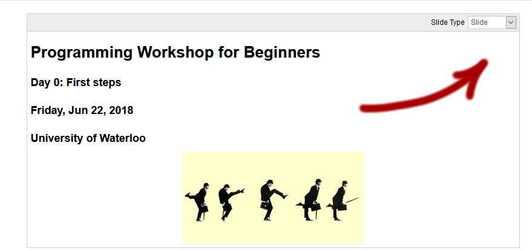
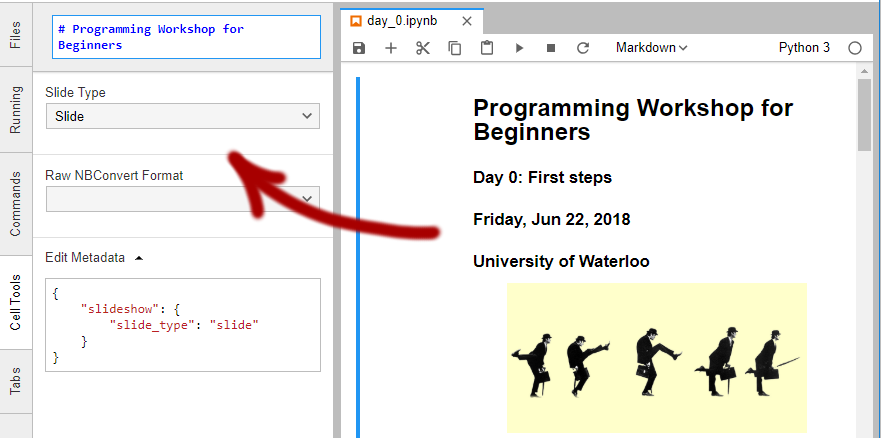

(This document is for course instructors)

# Making edits to the slides

The workflow for the slides follows this process:

## 1. Modify Jupyter notebooks

Run `jupyter notebook` and make your changes.

Select the appropriate slide type for each cell. In Jupyter notebook, this can be found in the top-right corner.



In Jupyter lab, this can be found in the metadata tab.



## 2. Export slides to HTML

Run the following command in your terminal:
```
jupyter nbconvert day_x.ipynb --to slides --post serve
```

It will export an HTML copy of that notebook, and open a copy in your browser.


**Important**: Make sure that long slides have a scrollbar. This seems to be related to `nbconvert` version, and newer installs may not have this (possibly unintended?) feature. Version 5.1.0 is known to work, so you can run `pip install nbconvert==5.1.0` to forcibly downgrade.

## 3. Commit things to the `gh-pages` branch.

This branch is where the public-facing website lives. Keeping the branches in sync can be confusing, so if you thought you made some changes but can't see them, it's probably related to this.
